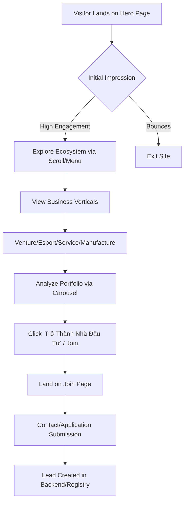
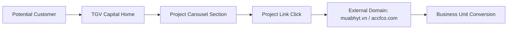

# Business Workflows - Tam Giang Capital Landing Page

## 1. User Journey: Investor Acquisition Flow
The primary workflow for the landing page is to convert anonymous visitors into strategic partners/investors.

---

## 2. Business Process: Ecosystem Referral Flow
A key function of the site is to route traffic to the operational sub-brands.

---

## 3. Operations: Content Management Workflow
(Future State)

1. **Information Update**: New project acquired by the group.
2. **Design Addition**: Marketing team provides brand assets and gradient themes.
3. **Implementation**: Developer adds a new entry to the `projects` object in `ProjectCarousel.tsx`.
4. **Verification**: Verify external link and responsive display.
5. **Deployment**: CI/CD push to live production site.

---

## 4. Stakeholder Communication Logic
- **Header Dynamics**: 
    - At top (Scroll=0): Implies "Ecosystem Overview" via transparency and hero focus.
    - Scrolled (>20px): Implies "Active Navigation" via solid background and clear UI visibility.
- **CTA Localization**: Use of Vietnamese for emotional resonance ("Kiến Tạo Giá Trị") combined with English professional terms ("Venture", "Capital").
